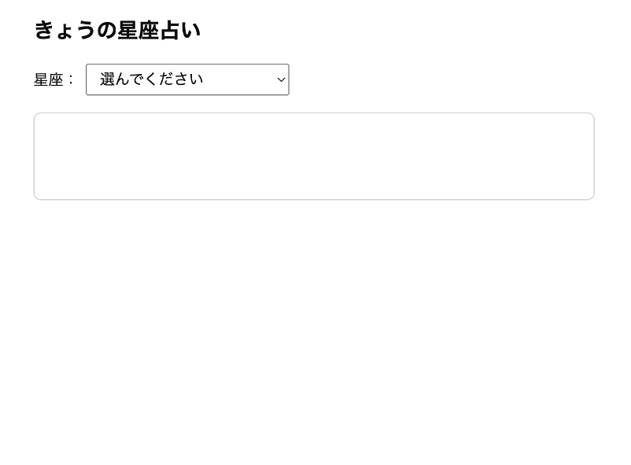

# jsQuiz-neo-07

「`fetch` で Web API からデータを取得する（Ajax）」課題です。

星座を選ぶと、その日の星座占いが表示されるようにします。
あなたが書くのは `index.html` の中の `getHoroscope(sign)` 関数だけです（画面・選択時の処理は用意済み）。

### 完成イメージ

星座を選ぶと、その日の星座占いが表示されます。



## エンドポイント

```
https://trident-web.kikirara.jp/horoscope/?sign=（星座）&day=TODAY
```

`sign` は星座の英語名（先頭大文字：`Aries`, `Taurus`, …, `Pisces`）、`day` は `TODAY`。

### レスポンスの形

```json
{
  "data": {
    "sign": "Leo",
    "horoscope": "獅子座にとって、今日は……（運勢の文章）"
  }
}
```

運勢の文章は `data.data.horoscope`（`response.json()` の結果を `data` に入れた場合）。

## あなたの課題：`getHoroscope(sign)` を書く

1. `async function getHoroscope(sign)` を作る
2. 上のエンドポイントに `fetch`（引数 `sign` を URL に埋め込む）
3. `await response.json()` でデータに変換する
4. 運勢の文章を `return` する

### ヒント

```js
async function getHoroscope(sign) {
  const response = await fetch(/* URL（sign を埋め込む） */);
  const data = await response.json();
  return /* 運勢の文章 */;
}
```

- `fetch(...)` と `response.json()` の両方に `await` が必要。
- URL は星座を固定で書かず、引数 `sign` を埋め込む。

## ローカルでの動作確認

`fetch` を使うため、VS Code の **Live Server** で `index.html` を開いてください（ダブルクリックでは動きません）。インターネット接続が必要です。

## 提出方法

1. このリポジトリを Fork
2. 自分の Fork を clone
3. ブランチを作る（例：`quiz7/kawaguchi`）
4. `students/{自分の番号}/index.html` を編集（ルートの `index.html` をコピーして使う）
5. commit / push（title：出席番号_名前、message：提出します。）
6. 元のリポジトリへ Pull Request

## 判定について

- PR を出すと自動判定が走り、合否がコメントされます（PR のコメント欄／Checks タブで確認）。

## 注意

- `getHoroscope(sign)` 以外は変更しない
- 星座を固定で書かない（必ず引数 `sign` を使う）／`day=TODAY` を付ける
- `students/` 以外のファイルは変更しない

---

## 先生向けメモ（`horoscope/index.php` の設置）

`horoscope` フォルダごとロリポップのWeb公開フォルダにアップロード。`https://trident-web.kikirara.jp/horoscope/?sign=Aries&day=TODAY` で JSON が返れば設置完了（`403` は未設置）。占いAPIの英語本文を日本語に翻訳して CORS 許可つきで返す中継。
